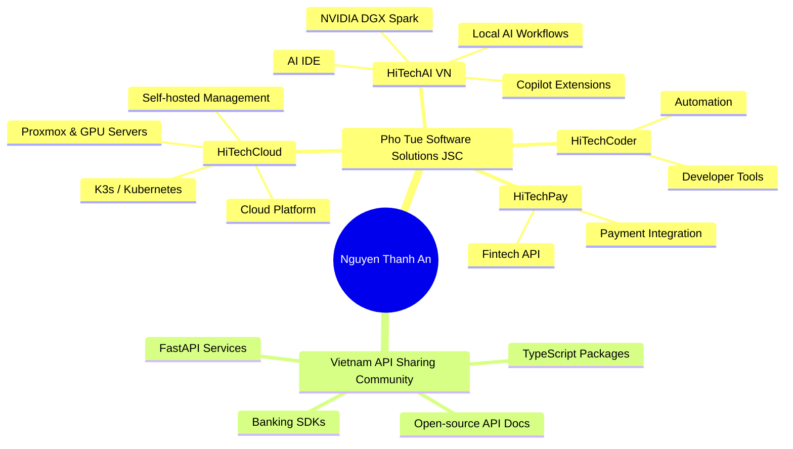

# Hello, my name is Nguyen Thanh An.👋

### Chairman & CEO — Pho Tue Software Solutions JSC · Cloud / AI / DevTools / Open Source Builder

  
  
  
  
  

  
  
  
  

 
---

## 🚀 Tổng quan

I am **Nguyen Thanh An** — Founder/Chairman & CEO at **Pho Tue Software Solutions JSC**, focusing on building a technology ecosystem including **HiTechCloud**, **HiTechAI**, **HiTechPay**, **HiTechCoder** and **HMI IDC**.

My primary focus is building and contributing to platforms in **cloud infrastructure**, **AI engineering**, **developer tools**, **automation**, **API integrations**, and **open-source** projects that empower and support the Vietnamese engineering community.

- 🏢 **Company:** Pho Tue Software Solutions JSC
- ☁️ **Cloud brand:** HiTechCloud
- 🤖 **AI ecosystem:** HiTechAI VN
- 🇻🇳 **Community:** Vietnam API Sharing Community
- 📍 **Location:** Ho Chi Minh City, Vietnam
- 🧭 **Focus:** Cloud, AI, DevTools, API, Automation, Infrastructure, Open Source
- 🏆 **GitHub achievements:** Pair Extraordinaire · Pull Shark · YOLO
- 📊 **Public activity:** 1,000+ contributions in the last year

---

## 🧩 What Am I Building?

<table>
  <tr>
    <td width="50%">
      <h3>☁️ Cloud Infrastructure</h3>
      
Cloud infrastructure management systems, **self-hosted platforms**, **Proxmox**, **Kubernetes/K3s**, **GPU servers**, **automation agents**, and **cloud management APIs**.

    </td>
    <td width="50%">
      <h3>🤖 AI Engineering</h3>
      
Local/private AI tools, **NVIDIA DGX Spark**, **Ollama**, **inference automation**, **AI IDE extensions**, and developer productivity workflows for accelerated software engineering.

    </td>
  </tr>
  <tr>
    <td width="50%">
      <h3>🛠️ Developer Tools</h3>
      
Extensions, **CLI tools**, **automation scripts**, **team toolkits**, **remote development environments**, **CI/CD pipelines**, **package tooling**, and modern product development workflows.

    </td>
    <td width="50%">
      <h3>🔌 API & Integration</h3>
      
API sharing communities, **banking integrations**, **REST API collections**, **FastAPI services**, **Python/TypeScript SDKs**, and developer integration documentation.

    </td>
  </tr>
</table>

---

## 🏢 Organizations I Manage

<table>
  <tr>
    <td width="33%" align="center">
      
      <h3><a href="https://github.com/hitechcloud-vietnam">HiTechCloud</a></h3>
      
Cloud platform, infrastructure automation, GPU server, Proxmox, K3s, self-hosted management tools.

      
<strong>71 public repositories</strong>

    </td>
    <td width="33%" align="center">
      
      <h3><a href="https://github.com/HiTechAI-VN">HiTechAI VN</a></h3>
      
AI IDE, Copilot-like extensions, remote development, AI coding workflow and local/private AI platform.

      
<strong>17 public repositories</strong>

    </td>
    <td width="33%" align="center">
      
      <h3><a href="https://github.com/Viet-Nam-API-Sharing-Community">Vietnam API Sharing Community</a></h3>
      
Community-driven projects focused on **API sharing**, **SDK development**, **banking integrations**, **automation tools**, and **open-source technologies** in Viet Nam.

      
<strong>22 public repositories</strong>

    </td>
  </tr>
</table>

---

## ⭐ Dự án nổi bật

### Cá nhân

| Project | Description | Tech |
|---|---|---|
| [`clawspark`](https://github.com/thanhan92-f1/clawspark) | One-click AI agent setup cho NVIDIA DGX Spark, Jetson và RTX hardware; OpenClaw + Ollama, fully local. | Shell · AI · NVIDIA |
| [`hitechclaw-ai`](https://github.com/thanhan92-f1/hitechclaw-ai) | AI tooling/workflow trong hệ sinh thái HiTechCloud/HiTechAI. | AI · Automation |
| [`hitechbenchmark`](https://github.com/thanhan92-f1/hitechbenchmark) | Benchmark tooling cho hệ thống AI/cloud. | TypeScript |
| [`vnnic_tldms`](https://github.com/thanhan92-f1/vnnic_tldms) | Công cụ/dự án liên quan domain registry/TLD management. | PHP |
| [`markitdown`](https://github.com/thanhan92-f1/markitdown) | Tooling xử lý/chuyển đổi tài liệu. | Python |

### HiTechCloud

| Project | Description | Tech |
|---|---|---|
| [`nvidia-ai-hub`](https://github.com/hitechcloud-vietnam/nvidia-ai-hub) | One-click AI app launcher cho NVIDIA DGX GPU, quản lý app AI GPU từ web UI hiện đại. | JavaScript · NVIDIA |
| [`cloud-server-open-claw-management`](https://github.com/hitechcloud-vietnam/cloud-server-open-claw-management) | Triển khai và quản lý OpenClaw trên cloud server bằng một lệnh, có SSL tự động qua Caddy và REST Management API. | JavaScript · Caddy |
| [`Proxmox-BackUp-PBS`](https://github.com/hitechcloud-vietnam/Proxmox-BackUp-PBS) | REST API collection đầy đủ cho Proxmox Backup Server. | API · Proxmox |
| [`Proxmox-Mail-GateWay`](https://github.com/hitechcloud-vietnam/Proxmox-Mail-GateWay) | REST API collection cho Proxmox Mail Gateway: auth, statistics, quarantine, ACL, node/cluster. | API · Proxmox |
| [`dgxarley`](https://github.com/hitechcloud-vietnam/dgxarley) | Ansible playbooks cho K3s cluster 3 node với NVIDIA DGX Spark phục vụ distributed LLM inference. | Python · Ansible · K3s |
| [`hitechcloudpanel`](https://github.com/hitechcloud-vietnam/hitechcloudpanel) | Self-hosted server management tool trong hệ sinh thái HiTechCloud. | PHP |

### HiTechAI VN

| Project | Description | Tech |
|---|---|---|
| [`hitechai-copilot-chat`](https://github.com/HiTechAI-VN/hitechai-copilot-chat) | HiTechAI Studio AI — autonomous AI peer programmer. | TypeScript |
| [`hitechai-copilotstudio`](https://github.com/HiTechAI-VN/hitechai-copilotstudio) | Copilot Studio Extension cho HiTechAI Studio Code. | TypeScript |
| [`hitechai-studio-code`](https://github.com/HiTechAI-VN/hitechai-studio-code) | HiTechAI/HiTechCloud Studio Code platform. | TypeScript |
| [`hitechai-team-kit-project`](https://github.com/HiTechAI-VN/hitechai-team-kit-project) | Team Kit cho HiTechAI Studio Code. | TypeScript |
| [`hitechai-remote-release`](https://github.com/HiTechAI-VN/hitechai-remote-release) | Remote development/release tooling. | Dockerfile |
| [`deepseek-v4-flash-dual-spark-recipe`](https://github.com/HiTechAI-VN/deepseek-v4-flash-dual-spark-recipe) | Recipe tái lập triển khai DeepSeek-V4-Flash trên dual NVIDIA DGX Spark cluster. | AI · vLLM · NVIDIA |

### Vietnam API Sharing Community

| Project | Description | Tech |
|---|---|---|
| [`acbbank-python`](https://github.com/Viet-Nam-API-Sharing-Community/acbbank-python) | API service cho các chức năng ngân hàng ACB sử dụng FastAPI. | Python · FastAPI |
| [`Api-Mbbank-Biz`](https://github.com/Viet-Nam-API-Sharing-Community/Api-Mbbank-Biz) | GotoBank — automated banking solution. | Python |
| [`lpbank`](https://github.com/Viet-Nam-API-Sharing-Community/lpbank) | SDK/API integration cho LPBank. | TypeScript |
| [`ocb_python`](https://github.com/Viet-Nam-API-Sharing-Community/ocb_python) | Python integration cho OCB. | Python |
| [`msb_python`](https://github.com/Viet-Nam-API-Sharing-Community/msb_python) | Python integration cho MSB. | Python |
| [`bank-captcha`](https://github.com/Viet-Nam-API-Sharing-Community/bank-captcha) | Tooling liên quan captcha/API banking. | API · Automation |

---

## 🧠 Tech stack & chuyên môn

<!-- PROFILE-METRICS:START -->

> Auto-generated from **231 public repositories** across the personal profile and managed organizations. Languages, repository counts and inferred stack are refreshed by GitHub Actions.

### Dynamic language coverage

| Language | Usage | Share |
|---|---:|---|
| **TypeScript** | `█████████░░░░░░░░░░░` | **47.1%** |
| **PHP** | `████░░░░░░░░░░░░░░░░` | **18.8%** |
| **Python** | `██░░░░░░░░░░░░░░░░░░` | **11.2%** |
| **JavaScript** | `██░░░░░░░░░░░░░░░░░░` | **8.9%** |
| **C++** | `█░░░░░░░░░░░░░░░░░░░` | **2.3%** |
| **Java** | `█░░░░░░░░░░░░░░░░░░░` | **1.9%** |
| **CSS** | `█░░░░░░░░░░░░░░░░░░░` | **1.6%** |
| **Go** | `█░░░░░░░░░░░░░░░░░░░` | **1.4%** |
| **C#** | `█░░░░░░░░░░░░░░░░░░░` | **1.1%** |
| **Shell** | `█░░░░░░░░░░░░░░░░░░░` | **0.9%** |
| **Groovy** | `█░░░░░░░░░░░░░░░░░░░` | **0.9%** |
| **HTML** | `█░░░░░░░░░░░░░░░░░░░` | **0.7%** |

### Account & organization scan

| Scope | Public repos scanned | Top primary languages |
|---|---:|---|
| **Nguyen Thanh An** | 121 | Shell, TypeScript, JavaScript, Python, PHP |
| **HiTechCloud** | 71 | Python, Dockerfile, Shell, JavaScript, Go |
| **HiTechAI VN** | 17 | TypeScript, C++, Dockerfile |
| **Vietnam API Sharing Community** | 22 | Python, JavaScript, TypeScript, HTML |

### Auto-detected tech stack

| Auto-detected stack | Signal |
|---|---|
| **Languages & Backend** | TypeScript · Node.js · PHP · Laravel · Python · FastAPI · SDK · JavaScript · Go |
| **Cloud / DevOps / Infra** | Linux · Provisioning · NVIDIA GPU |
| **AI / Automation / Tooling** | VS Code Extension · Developer Tools · Automation · CLI · One-click Setup · AI Engineering |
| **API / Community** | Updating from repository metadata |

### High-signal repositories

| Repository | Main signal |
|---|---|
| [`thanhan92-f1/clawspark`](https://github.com/thanhan92-f1/clawspark) | Shell · amd · claw · clawdbot · ⭐ 14 · ⑂ 4 |
| [`hitechcloud-vietnam/nvidia-ai-hub`](https://github.com/hitechcloud-vietnam/nvidia-ai-hub) | JavaScript · ai · ai-agent · ai-tools · ⭐ 4 |
| [`thanhan92-f1/nemoclaw-openclaw-sandbox`](https://github.com/thanhan92-f1/nemoclaw-openclaw-sandbox) | Shell · ai · ai-agent · nemoclaw · ⭐ 5 |
| [`thanhan92-f1/hitechclaw-ai`](https://github.com/thanhan92-f1/hitechclaw-ai) | TypeScript · ⭐ 6 |
| [`thanhan92-f1/nvidia-570-proxmox-pve9`](https://github.com/thanhan92-f1/nvidia-570-proxmox-pve9) | Shell · ⭐ 2 |
| [`hitechcloud-vietnam/donvihanhchinhvietnam`](https://github.com/hitechcloud-vietnam/donvihanhchinhvietnam) | ⭐ 1 · ⑂ 1 |
| [`thanhan92-f1/coinguonlichsu`](https://github.com/thanhan92-f1/coinguonlichsu) | JavaScript · ⭐ 1 |
| [`thanhan92-f1/easydcim-colocation-for-hostbill`](https://github.com/thanhan92-f1/easydcim-colocation-for-hostbill) | ⑂ 2 |

Last metrics refresh: GitHub Actions scheduled update · run #1. Detected 73 languages from GitHub repository language data.

<!-- PROFILE-METRICS:END -->

---

## 📊 GitHub analytics

---

## 🔥 Profile contributions

<picture>
  <source media="(prefers-color-scheme: dark)" srcset="https://raw.githubusercontent.com/thanhan92-f1/thanhan92-f1/output/github-contribution-grid-snake-dark.svg" />
  <source media="(prefers-color-scheme: light)" srcset="https://raw.githubusercontent.com/thanhan92-f1/thanhan92-f1/output/github-contribution-grid-snake.svg" />
  
</picture>

 

Contribution Snake automatically updates every 12 hours using GitHub Actions.

  

### Contribution focus

| Area | Contribution direction |
|---|---|
| ☁️ Cloud & Infrastructure | HiTechCloud platform, Proxmox/K3s/GPU server automation, self-hosted management tools |
| 🤖 AI Engineering | Local/private AI workflows, AI IDE extensions, NVIDIA DGX Spark recipes, inference automation |
| 🛠️ Developer Tools | VS Code-like tooling, CLI/script automation, CI/CD, remote development workflow |
| 🔌 API & Integration | Banking APIs, FastAPI services, SDKs, REST collections, Vietnamese API documentation |
| 🇻🇳 Community | Open-source examples, reusable templates, practical technical resources for Vietnam developers |

> Goal: keep building useful repositories, practical automation, clean documentation and community-driven open-source resources.

---

## 🗺️ Hệ sinh thái

---

## 🎯 Giá trị mình theo đuổi

- **Build in public:** chia sẻ công cụ, tài liệu và kinh nghiệm triển khai thực tế.
- **Automation-first:** tự động hóa hạ tầng, vận hành, API và quy trình phát triển.
- **Local/private AI:** ưu tiên AI chạy được tại chỗ, kiểm soát dữ liệu và tối ưu chi phí.
- **Developer experience:** công cụ phải dễ dùng, có tài liệu, có một-lệnh-chạy-được.
- **Vietnam tech community:** đóng góp tài nguyên kỹ thuật cho cộng đồng Việt Nam.

---

## 🤝 Kết nối

| Kênh | Liên kết |
|---|---|
| Website công ty | <https://photuesoftware.com/> |
| HiTechCloud Portal | <https://my.hitechcloud.vn/> |
| GitHub | <https://github.com/thanhan92-f1> |
| LinkedIn | <https://www.linkedin.com/in/nguyenthanhan92-f1/> |
| Facebook | <https://www.facebook.com/Anthanh78> |
| X / Twitter | <https://x.com/anthanh92f1> |
| HiTechCloud Org | <https://github.com/hitechcloud-vietnam> |
| HiTechAI VN Org | <https://github.com/HiTechAI-VN> |
| Vietnam API Sharing Community | <https://github.com/Viet-Nam-API-Sharing-Community> |

---

### “Build practical technology, automate the boring parts, and share value back to the community.”

