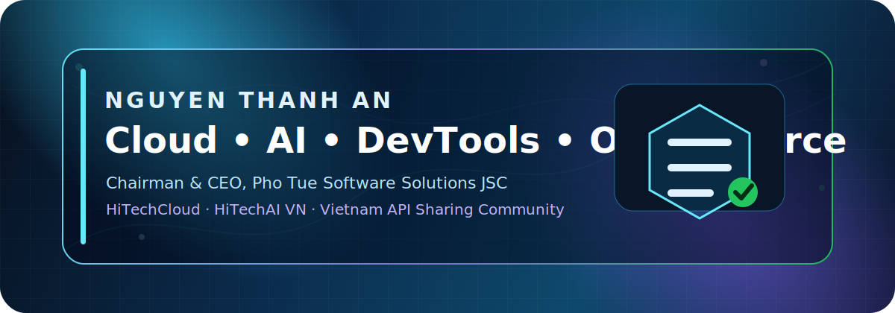
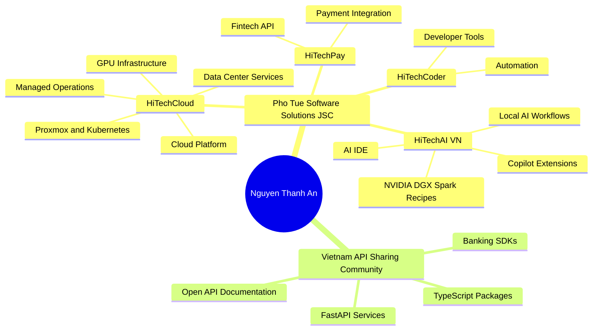

#  Hello, my name is Nguyen Thanh An.👋

### Chairman & CEO — Pho Tue Software Solutions JSC · Cloud Infrastructure · AI/ML/GPUs · AI Engineering · Developer Platforms · Open Source Builder

  

  
  
  

  
  
  
  

---

## Executive Profile

I am **Nguyen Thanh An**, Chairman & CEO of **Pho Tue Software Solutions JSC**, building a practical technology ecosystem across **cloud infrastructure**, **AI engineering**, **developer platforms**, **financial/API integrations**, and **open-source enablement** for Vietnam and regional engineering teams.

My work combines executive leadership with hands-on engineering. I focus on turning infrastructure and software capabilities into reusable platforms: cloud services, GPU/AI infrastructure, automation systems, developer tooling, integration SDKs, and community-facing technical assets.

| Executive signal | Portfolio focus |
|---|---|
| **Company** | Pho Tue Software Solutions JSC |
| **Cloud platform** | HiTechCloud — cloud, data center, GPU, managed infrastructure |
| **AI platform** | HiTechAI VN — AI IDE, Copilot-style tools, local/private AI workflows |
| **Developer community** | Vietnam API Sharing Community — open APIs, SDKs, banking integration references |
| **Operating base** | Ho Chi Minh City, Vietnam |
| **GitHub achievements** | Pair Extraordinaire · Pull Shark · YOLO |
| **Public activity** | 1,000+ contributions in the last year |

---

## Investment Thesis & Strategic Direction

> Build sovereign, automation-first technology platforms that lower the cost of cloud adoption, accelerate AI engineering, and make high-quality integration tooling accessible to Vietnamese developers and enterprises.

| Strategic pillar | Market-facing outcome |
|---|---|
| **Cloud infrastructure** | Reliable data center, cloud server, GPU, backup, networking, and self-hosted platform operations. |
| **AI engineering** | Local/private AI workflows, NVIDIA DGX Spark recipes, inference automation, AI coding assistants, and enterprise AI enablement. |
| **Developer platforms** | VS Code-style extensions, remote development tools, CI/CD automation, team toolkits, and one-command operational workflows. |
| **API ecosystems** | Banking/API integration examples, SDKs, FastAPI services, REST collections, documentation, and reusable reference implementations. |
| **Open-source leverage** | Public repositories that convert internal engineering patterns into transparent, reusable community assets. |

---

## Organizations Under Management

<table>
  <tr>
    <td width="33%" align="center">
      
      <h3><a href="https://github.com/hitechcloud-vietnam">HiTechCloud</a></h3>
      
Cloud platform, data center operations, GPU servers, Proxmox, Kubernetes/K3s, self-hosted management tooling, and infrastructure automation.

      
<strong>71 public repositories</strong>

    </td>
    <td width="33%" align="center">
      
      <h3><a href="https://github.com/HiTechAI-VN">HiTechAI VN</a></h3>
      
AI IDE, Copilot-style extensions, remote development tooling, local/private AI workflows, and applied AI engineering assets.

      
<strong>17 public repositories</strong>

    </td>
    <td width="33%" align="center">
      
      <h3><a href="https://github.com/Viet-Nam-API-Sharing-Community">Vietnam API Sharing Community</a></h3>
      
Community-driven API sharing, SDK development, banking integrations, automation utilities, and open-source reference implementations.

      
<strong>22 public repositories</strong>

    </td>
  </tr>
</table>

---

## Strategic Project Portfolio

### Personal engineering portfolio

| Project | Strategic signal | Technology |
|---|---|---|
| [`clawspark`](https://github.com/thanhan92-f1/clawspark) | One-command AI agent setup for NVIDIA DGX Spark, Jetson, and RTX hardware with OpenClaw and Ollama for fully local AI workflows. | Shell · AI · NVIDIA |
| [`hitechclaw-ai`](https://github.com/thanhan92-f1/hitechclaw-ai) | AI tooling and workflow assets aligned with the HiTechCloud and HiTechAI engineering ecosystem. | TypeScript · AI · Automation |
| [`hitechbenchmark`](https://github.com/thanhan92-f1/hitechbenchmark) | Benchmark tooling for cloud and AI infrastructure evaluation. | TypeScript |
| [`vnnic_tldms`](https://github.com/thanhan92-f1/vnnic_tldms) | Domain registry and TLD management tooling. | PHP |
| [`markitdown`](https://github.com/thanhan92-f1/markitdown) | Document processing and content conversion tooling. | Python |

### HiTechCloud engineering portfolio

| Project | Strategic signal | Technology |
|---|---|---|
| [`nvidia-ai-hub`](https://github.com/hitechcloud-vietnam/nvidia-ai-hub) | One-click AI application launcher for NVIDIA DGX/GPU infrastructure with a modern web UI. | JavaScript · NVIDIA |
| [`cloud-server-open-claw-management`](https://github.com/hitechcloud-vietnam/cloud-server-open-claw-management) | Cloud server OpenClaw deployment and management with automatic SSL via Caddy and REST APIs. | JavaScript · Caddy |
| [`Proxmox-BackUp-PBS`](https://github.com/hitechcloud-vietnam/Proxmox-BackUp-PBS) | Complete REST API collection for Proxmox Backup Server operations. | API · Proxmox |
| [`Proxmox-Mail-GateWay`](https://github.com/hitechcloud-vietnam/Proxmox-Mail-GateWay) | Proxmox Mail Gateway API collection for authentication, statistics, quarantine, ACL, node, and cluster operations. | API · Proxmox |
| [`dgxarley`](https://github.com/hitechcloud-vietnam/dgxarley) | Ansible playbooks for a three-node K3s cluster with NVIDIA DGX Spark for distributed LLM inference. | Python · Ansible · K3s |
| [`hitechcloudpanel`](https://github.com/hitechcloud-vietnam/hitechcloudpanel) | Self-hosted server management platform within the HiTechCloud ecosystem. | PHP |

### HiTechAI VN engineering portfolio

| Project | Strategic signal | Technology |
|---|---|---|
| [`hitechai-copilot-chat`](https://github.com/HiTechAI-VN/hitechai-copilot-chat) | HiTechAI Studio AI — autonomous AI peer programmer and applied coding assistant experience. | TypeScript |
| [`hitechai-copilotstudio`](https://github.com/HiTechAI-VN/hitechai-copilotstudio) | Copilot Studio extension for HiTechAI Studio Code. | TypeScript |
| [`hitechai-studio-code`](https://github.com/HiTechAI-VN/hitechai-studio-code) | HiTechAI/HiTechCloud Studio Code platform foundation. | TypeScript |
| [`hitechai-team-kit-project`](https://github.com/HiTechAI-VN/hitechai-team-kit-project) | Team Kit for collaborative HiTechAI Studio Code workflows. | TypeScript |
| [`hitechai-remote-release`](https://github.com/HiTechAI-VN/hitechai-remote-release) | Remote development and release tooling for distributed engineering workflows. | Dockerfile |
| [`deepseek-v4-flash-dual-spark-recipe`](https://github.com/HiTechAI-VN/deepseek-v4-flash-dual-spark-recipe) | Reproducible DeepSeek-V4-Flash deployment recipe on a dual NVIDIA DGX Spark cluster. | AI · vLLM · NVIDIA |

### Vietnam API Sharing Community portfolio

| Project | Strategic signal | Technology |
|---|---|---|
| [`acbbank-python`](https://github.com/Viet-Nam-API-Sharing-Community/acbbank-python) | FastAPI service reference for ACB banking workflows. | Python · FastAPI |
| [`Api-Mbbank-Biz`](https://github.com/Viet-Nam-API-Sharing-Community/Api-Mbbank-Biz) | GotoBank automated banking integration reference implementation. | Python |
| [`lpbank`](https://github.com/Viet-Nam-API-Sharing-Community/lpbank) | LPBank SDK and API integration reference. | TypeScript |
| [`ocb_python`](https://github.com/Viet-Nam-API-Sharing-Community/ocb_python) | OCB banking integration reference for Python developers. | Python |
| [`msb_python`](https://github.com/Viet-Nam-API-Sharing-Community/msb_python) | MSB banking integration reference for Python developers. | Python |
| [`bank-captcha`](https://github.com/Viet-Nam-API-Sharing-Community/bank-captcha) | CAPTCHA and automation tooling related to banking/API workflows. | API · Automation |

---

## Generated Dynamic Profile Intelligence

<!-- PROFILE-METRICS:START -->

> Auto-generated profile intelligence from **232 public repositories** across the personal profile and managed organizations. Repository signals, language coverage and inferred capabilities refresh through GitHub Actions.

### Real-time portfolio signals

| Live signal | Value |
|---|---:|
| Public repositories monitored | **232** |
| Active source repositories | **143** |
| Detected source languages | **73** |
| Aggregate public stars | **38** |
| Aggregate public forks | **10** |
| Leading language by code volume | **TypeScript** |
| Most recent public repository update | **2026-05-26** |

### Dynamic language coverage

| Language | Usage | Share |
|---|---:|---|
| **TypeScript** | `█████████░░░░░░░░░░░` | **47.1%** |
| **PHP** | `████░░░░░░░░░░░░░░░░` | **18.8%** |
| **Python** | `██░░░░░░░░░░░░░░░░░░` | **11.2%** |
| **JavaScript** | `██░░░░░░░░░░░░░░░░░░` | **8.9%** |
| **C++** | `█░░░░░░░░░░░░░░░░░░░` | **2.3%** |
| **Java** | `█░░░░░░░░░░░░░░░░░░░` | **1.9%** |
| **CSS** | `█░░░░░░░░░░░░░░░░░░░` | **1.6%** |
| **Go** | `█░░░░░░░░░░░░░░░░░░░` | **1.4%** |
| **C#** | `█░░░░░░░░░░░░░░░░░░░` | **1.1%** |
| **Shell** | `█░░░░░░░░░░░░░░░░░░░` | **0.9%** |
| **Groovy** | `█░░░░░░░░░░░░░░░░░░░` | **0.9%** |
| **HTML** | `█░░░░░░░░░░░░░░░░░░░` | **0.7%** |

### Account & organization scan

| Scope | Public repos scanned | Stars | Forks | Top primary languages |
|---|---:|---:|---:|---|
| **Nguyen Thanh An** | 121 | 30 | 6 | Shell, TypeScript, JavaScript, Python, PHP |
| **HiTechCloud** | 72 | 7 | 4 | Python, Dockerfile, Shell, JavaScript, Go |
| **HiTechAI VN** | 17 | 1 | 0 | TypeScript, C++, Dockerfile |
| **Vietnam API Sharing Community** | 22 | 0 | 0 | Python, JavaScript, TypeScript, HTML |

### Auto-detected tech stack

| Auto-detected stack | Signal |
|---|---|
| **Languages & Backend** | TypeScript · Node.js · PHP · Laravel · Python · FastAPI · SDK · JavaScript · Go |
| **Cloud / DevOps / Infra** | Linux · Provisioning · NVIDIA GPU |
| **AI / Automation / Tooling** | VS Code Extension · Developer Tools · Automation · CLI · One-click Setup · AI Engineering |
| **API / Community** | Updating from repository metadata |

### High-signal repositories

| Repository | Main signal |
|---|---|
| [`thanhan92-f1/clawspark`](https://github.com/thanhan92-f1/clawspark) | Shell · amd · claw · clawdbot · ⭐ 14 · ⑂ 4 |
| [`hitechcloud-vietnam/nvidia-ai-hub`](https://github.com/hitechcloud-vietnam/nvidia-ai-hub) | JavaScript · ai · ai-agent · ai-tools · ⭐ 4 |
| [`thanhan92-f1/nemoclaw-openclaw-sandbox`](https://github.com/thanhan92-f1/nemoclaw-openclaw-sandbox) | Shell · ai · ai-agent · nemoclaw · ⭐ 5 |
| [`thanhan92-f1/hitechclaw-ai`](https://github.com/thanhan92-f1/hitechclaw-ai) | TypeScript · ⭐ 6 |
| [`thanhan92-f1/nvidia-570-proxmox-pve9`](https://github.com/thanhan92-f1/nvidia-570-proxmox-pve9) | Shell · ⭐ 2 |
| [`hitechcloud-vietnam/donvihanhchinhvietnam`](https://github.com/hitechcloud-vietnam/donvihanhchinhvietnam) | ⭐ 1 · ⑂ 1 |
| [`thanhan92-f1/coinguonlichsu`](https://github.com/thanhan92-f1/coinguonlichsu) | JavaScript · ⭐ 1 |
| [`thanhan92-f1/easydcim-colocation-for-hostbill`](https://github.com/thanhan92-f1/easydcim-colocation-for-hostbill) | ⑂ 2 |

Last metrics refresh: GitHub Actions scheduled/manual update · 2026-05-26 22:24 UTC · run #3. Detected 73 languages from GitHub repository language data.

<!-- PROFILE-METRICS:END -->

---

## GitHub Analytics

---

## Profile Contributions

<picture>
  <source media="(prefers-color-scheme: dark)" srcset="https://raw.githubusercontent.com/thanhan92-f1/thanhan92-f1/output/github-contribution-grid-snake-dark.svg" />
  <source media="(prefers-color-scheme: light)" srcset="https://raw.githubusercontent.com/thanhan92-f1/thanhan92-f1/output/github-contribution-grid-snake.svg" />
  
</picture>

 

Contribution Snake automatically updates every 12 hours using GitHub Actions.

  

### Contribution operating model

| Area | Contribution direction |
|---|---|
| **Cloud & infrastructure** | HiTechCloud platform assets, Proxmox/K3s/GPU automation, self-hosted management tools, and operational runbooks. |
| **AI engineering** | Local/private AI workflows, AI IDE extensions, NVIDIA DGX Spark recipes, inference automation, and applied developer AI. |
| **Developer tools** | VS Code-style tooling, CLI/script automation, CI/CD patterns, remote development workflows, and team enablement kits. |
| **API & integration** | Banking APIs, FastAPI services, SDKs, REST collections, reusable examples, and implementation documentation. |
| **Community leverage** | Open-source templates, technical references, implementation notes, and practical engineering assets for Vietnam developers. |

---

## Ecosystem Map

---

## Operating Principles

- **Build in public:** transform practical engineering work into reusable repositories, documentation, and implementation references.
- **Automation-first:** automate infrastructure, operations, APIs, releases, and developer workflows wherever repeatability matters.
- **Local/private AI:** prioritize data control, deployment sovereignty, cost efficiency, and enterprise-ready AI operations.
- **Developer experience:** ship tools that are documented, reproducible, and easy to run with minimal operational friction.
- **Vietnam technology ecosystem:** contribute durable technical assets for local developers, startups, enterprises, and communities.

---

## Connect

| Channel | Link |
|---|---|
| Company website | <https://photuesoftware.com/> |
| HiTechCloud customer portal | <https://my.hitechcloud.vn/> |
| GitHub | <https://github.com/thanhan92-f1> |
| LinkedIn | <https://www.linkedin.com/in/nguyenthanhan92-f1/> |
| Facebook | <https://www.facebook.com/Anthanh78> |
| X / Twitter | <https://x.com/anthanh92f1> |
| HiTechCloud organization | <https://github.com/hitechcloud-vietnam> |
| HiTechAI VN organization | <https://github.com/HiTechAI-VN> |
| Vietnam API Sharing Community | <https://github.com/Viet-Nam-API-Sharing-Community> |

---

### Build practical technology, automate the critical path, and return value to the engineering community.

